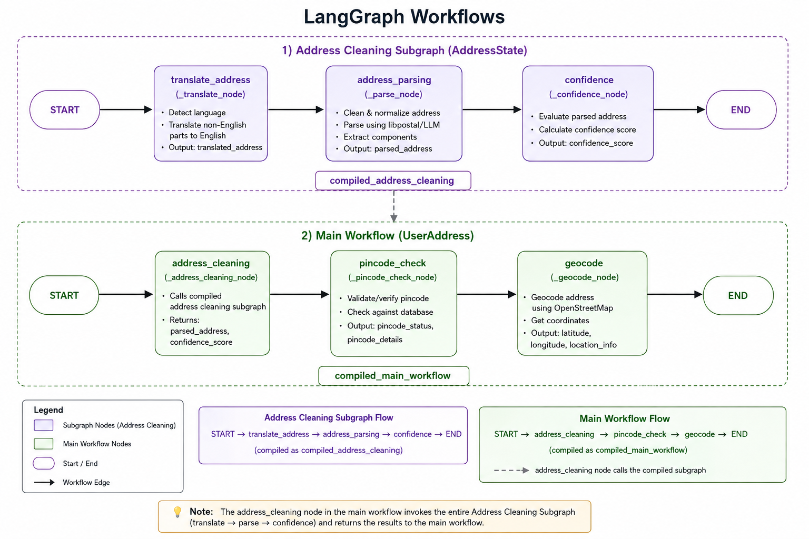

# Pata — Indian Address Cleaning & Geocoding API

Pata is an MVP for **Indian address intelligence for last-mile delivery**. It converts messy, multilingual, informal, or incomplete delivery addresses into structured address data, validates postal information, evaluates address confidence, and converts the address into geographic coordinates.

The project uses a **hybrid architecture**: specialized tools handle fast deterministic processing, while Gemini is used selectively for confidence scoring and reasoning.

## ✨ Features

### Address Processing
- Multilingual address translation using `deep-translator`
- Landmark-prefix cleanup for phrases such as near, opposite, behind, beside, and close to
- Address parsing using **libpostal**
- Structured fields: house number, building, street, landmark, area, city, district, state, postal code, country

### Validation
- Local Indian pincode CSV/dataset lookup
- Pincode existence checking
- City and state consistency checking
- Avoids unnecessary LLM/API calls for deterministic validation

### AI Confidence
- Gemini LLM evaluates address quality
- Returns a confidence score and reason
- Gemini is used selectively rather than for the complete pipeline

### Geocoding
- `geopy.geocoders.Nominatim`
- OpenStreetMap / Nominatim location data
- India-restricted geocoding
- Returns latitude, longitude and location information

### Workflow
- LangChain for LLM integration
- LangGraph for the main workflow and nested address-cleaning subgraph

### API & UI
- FastAPI backend
- Swagger/OpenAPI documentation
- Simple browser dashboard
- Temporary dummy users
- libpostal health endpoint

### Deployment
- Dockerized application
- Linux environment inside Docker for libpostal
- Recommended for Windows because libpostal has native/Linux-oriented dependencies

---

## 🔄 Workflow

### LangGraph Workflow Architecture

The project uses a **nested LangGraph architecture**. The main workflow invokes the compiled address-cleaning subgraph before continuing with pincode validation and geocoding.



```text
Raw / Messy Address
        ↓
Translate Address
        ↓
Strip Landmark Prefix
        ↓
Parse with libpostal
        ↓
Validate Pincode / City / State
        ↓
Confidence Score + Reason
        ↓
Geocode with Nominatim
        ↓
Latitude + Longitude
        ↓
Delivery Location
```

The LangGraph structure is:

```text
MAIN WORKFLOW

START
  ↓
address_cleaning
  ↓
pincode_check
  ↓
geocode
  ↓
END
```

The `address_cleaning` node invokes the compiled nested graph:

```text
ADDRESS CLEANING SUBGRAPH

START
  ↓
translate_address
  ↓
address_parsing
  ↓
confidence
  ↓
END
```

---
## 🧰 Technology Stack

| Category | Technology | Purpose |
|---|---|---|
| API | **FastAPI** | Backend REST API |
| Workflow | **LangGraph** | Main and nested workflows |
| LLM Framework | **LangChain** | Gemini integration/orchestration |
| Translation | **deep-translator** | Regional language → English |
| Address Parsing | **libpostal** | Fast structured address parsing |
| AI | **Gemini LLM** | Confidence score and reasoning |
| Validation | **Indian Pincode CSV** | Pincode, city and state validation |
| Geocoding | **geopy** | Python geocoding interface |
| Location Data | **OpenStreetMap / Nominatim** | Address → coordinates |
| Deployment | **Docker** | Reproducible Linux environment |
| Documentation | **Swagger / OpenAPI** | API testing and documentation |

---

## 🏗️ Architecture

```text
                         ┌───────────────────────┐
                         │       FastAPI         │
                         │       REST API        │
                         └───────────┬───────────┘
                                     │
                                     ↓
                         ┌───────────────────────┐
                         │    Main LangGraph    │
                         │                       │
                         │  address_cleaning    │
                         │  pincode_check       │
                         │  geocode             │
                         └───────────┬───────────┘
                                     │
              ┌──────────────────────┴──────────────────────┐
              ↓                                             ↓
   ┌────────────────────────┐                   ┌────────────────────┐
   │ Address Cleaning        │                   │ Pincode Validation │
   │ LangGraph Subgraph     │                   │                    │
   └───────────┬────────────┘                   │ Local CSV          │
               │                                │ City / State check │
               ↓                                └────────────────────┘
   ┌────────────────────────┐
   │ translate_address      │
   │ address_parsing        │
   │ confidence             │
   └───────────┬────────────┘
               │
               ↓
   ┌────────────────────────┐
   │ Structured Address     │
   └───────────┬────────────┘
               │
               ↓
   ┌────────────────────────┐
   │ Nominatim / OpenStreet │
   │ Map Geocoding           │
   └───────────┬────────────┘
               │
               ↓
        Latitude / Longitude
```

---

## 📁 Project Structure

```text
app/
├── main.py
│   └── FastAPI application and API routes
│
├── workflow.py
│   └── Main and nested LangGraph workflows
│
├── address_cleaning.py
│   └── Translation, landmark cleanup,
│       parsing and confidence functions
│
├── states.py
│   └── LangGraph state definitions
│
└── services/
    └── geocode_service.py
        └── geopy + Nominatim geocoding

Dockerfile
README.md
```

---

## 🧪 Example Request

```json
{
  "name": "John Doe",
  "phone": "9999999999",
  "pincode": "500001",
  "landmark": "Near Charminar",
  "address": "Charminar ke paas, Hyderabad"
}
```

## Example Response

```json
{
  "name": "John Doe",
  "phone": "9999999999",
  "pincode": "500001",
  "landmark": "Near Charminar",
  "address": {
    "raw_address": "Charminar ke paas, Hyderabad",
    "cleaned_address": "Charminar ke paas, Hyderabad",
    "translated_address": "...",
    "parsed_address": {
      "house_number": "",
      "building": "",
      "street": "",
      "landmark": "",
      "area": "",
      "city": "Hyderabad",
      "district": "",
      "state": "",
      "postal_code": "",
      "country": "India"
    },
    "confidence_score": 92,
    "confidence_reason": "The address contains sufficient location information.",
    "lat": 17.3616,
    "lon": 78.4747,
    "latitude": 17.3616,
    "longitude": 78.4747
  }
}
```

> Response values are illustrative. Actual parsed fields, confidence and coordinates depend on the input address and external data.

---

## 🔌 API Routes

| Method | Route | Purpose |
|---|---|---|
| `GET` | `/health` | Checks whether libpostal is available |
| `POST` | `/parse` | Returns raw libpostal address components |
| `POST` | `/expand` | Returns normalized address expansions |
| `POST` | `/workflow/clean` | Runs the complete LangGraph workflow |
| `GET` | `/users` | Lists temporary dummy users |
| `GET` | `/users/{user_id}/address` | Returns original and workflow-modified address |

---

## 📖 Swagger Documentation

After starting the app:

```text
http://localhost:8000/docs
```

Swagger allows you to inspect schemas and test the API interactively.

---

## 🖥️ Demo UI

Open:

```text
http://localhost:8000/
```

The dashboard allows you to:
- Select a dummy customer
- View the original address
- View the workflow-processed address
- Inspect parsed fields
- View confidence information
- View latitude and longitude

To list demo users:

```http
GET /users
```

Then open the returned detail URL, for example:

```http
GET /users/1/address
```

---

## 🌍 Geocoding

Pata uses:

```python
from geopy.geocoders import Nominatim
```

to convert an address into coordinates using OpenStreetMap/Nominatim.

```text
Validated Address
       ↓
Nominatim
       ↓
Latitude + Longitude
       ↓
Customer Location
```

> Nominatim performs **geocoding** (address → coordinates). A dedicated routing engine/service should be used for production route calculation and ETA.

---

## 🤖 Why Hybrid AI?

Pata intentionally does **not** use an LLM for every operation.

```text
                 PATA
                  |
       ┌──────────┴──────────┐
       ↓                     ↓
Specialized Tools        Gemini LLM
       ↓                     ↓
Translation             Confidence
Parsing                 Reasoning
Pincode validation
Geocoding
```

Specialized tools handle deterministic operations, while Gemini handles semantic address-quality reasoning.

This reduces unnecessary LLM usage and keeps the workflow faster and more predictable.

---

## 🐳 Run with Docker

Docker is recommended on Windows because libpostal requires native dependencies that are easier to run inside a Linux environment.

### Build

```powershell
cd C:\Users\dell\Documents\ChatGPT\hack
docker build -t pata-address-api .
```

### Run

```powershell
docker run --rm -p 8000:8000 pata-address-api
```

Then open:

```text
http://localhost:8000/docs
```

or:

```text
http://localhost:8000/
```

The first build may take time because libpostal resources need to be downloaded/built.

---

## 🧪 Test from PowerShell

```powershell
Invoke-RestMethod http://localhost:8000/workflow/clean `
  -Method Post `
  -ContentType "application/json" `
  -Body '{"name":"John Doe","phone":"9999999999","pincode":"500001","landmark":"Near Charminar","address":"Near Charminar, Hyderabad"}'
```

---

## 🏥 Health Check

```http
GET /health
```

The endpoint reports whether the native libpostal dependency is available.

---

## ⚙️ Current Limitations

- Public Nominatim is suitable for a small demo and should not be treated as an unlimited production geocoding service.
- Production should use an appropriate geocoding provider or self-hosted service with caching and rate limits.
- Confidence scoring should be strengthened with deterministic rules and automated tests alongside the LLM.
- Pincode validation should use a reliable and regularly updated Indian postal dataset.
- Geocoding results should be cross-checked against pincode, city and state data.
- Landmark ambiguity such as `opposite temple` or `near gate 2` may require nearby OpenStreetMap landmark searches.
- Customers or delivery agents should be able to confirm/correct the final map pin.
- Production route calculation should use a dedicated routing engine.

---

## 🔮 Future Improvements

### Landmark Verification

Query nearby OpenStreetMap features to resolve:

```text
Near Temple
Opposite Hospital
Behind Mall
Near Gate 2
```

### Stronger Validation

Combine:

```text
libpostal
+
Pincode Dataset
+
City / State Validation
+
Geocoding Result
+
Nearby Landmarks
```

### Human Confirmation

```text
System Prediction
       ↓
Customer / Delivery Agent Confirmation
       ↓
Corrected Map Pin
```

### Production Geocoding

Add:

- Caching
- Rate limiting
- Retry handling
- Dedicated geocoding provider or self-hosted service

### Multi-Delivery Routing

Extend from:

```text
Delivery Agent → One Customer
```

to:

```text
Delivery Agent
      ↓
Customer A
      ↓
Customer B
      ↓
Customer C
      ↓
Optimized Delivery Route
```

---

## 🔐 Privacy

The original address should be retained only for as long as required to perform processing/geocoding.

When corrections are made:

- Keep the original input auditable.
- Store corrections as structured data.
- Avoid silently overwriting the original address.
- Avoid storing unnecessary personal information.

---

## 🎯 Project Goal

Pata transforms:

```text
Messy Address
      ↓
Clean Address
      ↓
Structured Address
      ↓
Validated Address
      ↓
Confidence
      ↓
Coordinates
      ↓
Delivery Location
```

### Core Principle

> **Use specialized systems for speed and reliability, and use AI where reasoning actually adds value.**

---

## 📌 Project Status

**MVP implemented**

Current implementation includes:

- FastAPI API
- Swagger documentation
- LangChain
- LangGraph nested workflow
- deep-translator
- libpostal
- Gemini LLM
- Indian pincode validation
- geopy
- OpenStreetMap Nominatim
- Docker-based deployment
- Demo dashboard
